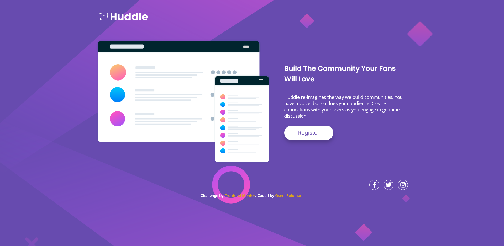

# Frontend Mentor - Huddle landing page with single introductory section solution

This is a solution to the [Huddle landing page with single introductory section challenge on Frontend Mentor](https://www.frontendmentor.io/challenges/huddle-landing-page-with-a-single-introductory-section-B_2Wvxgi0). Frontend Mentor challenges help you improve your coding skills by building realistic projects.

## Table of contents

- [Overview](#overview)
  - [The challenge](#the-challenge)
  - [Screenshot](#screenshot)
  - [Links](#links)
- [My process](#my-process)
  - [Built with](#built-with)
  - [What I learned](#what-i-learned)
- [Author](#author)

## Overview

### The challenge

Users should be able to:

- View the optimal layout for the page depending on their device's screen size
- See hover states for all interactive elements on the page

### Screenshot



### Links

- Solution URL: [solution URL](https://github.com/SoloLere/huddle.git)
- Live Site URL: [live site URL](https://sololere.github.io/huddle/)

## My process

### Built with

- Semantic HTML5 markup
- CSS custom properties
- Flexbox
- Mobile-first workflow

### What I learned

- A key takeaway from this project is that whenver I'm using flex, try to wrap image type flex items in a div, else espect some discrepancy between what will be displayed in firefox vs chrome.

```html
<article class="hero-image">
  
</article>
```

- Also I discovered I couldn't add a box shadow to my button whenever I used mix-blend-mode on it.

## Author

- Mail - [Oseni Solomon](jnrolalere@gmail.com)
- Frontend Mentor - [@myusername](https://www.frontendmentor.io/profile/@SoloLere)
